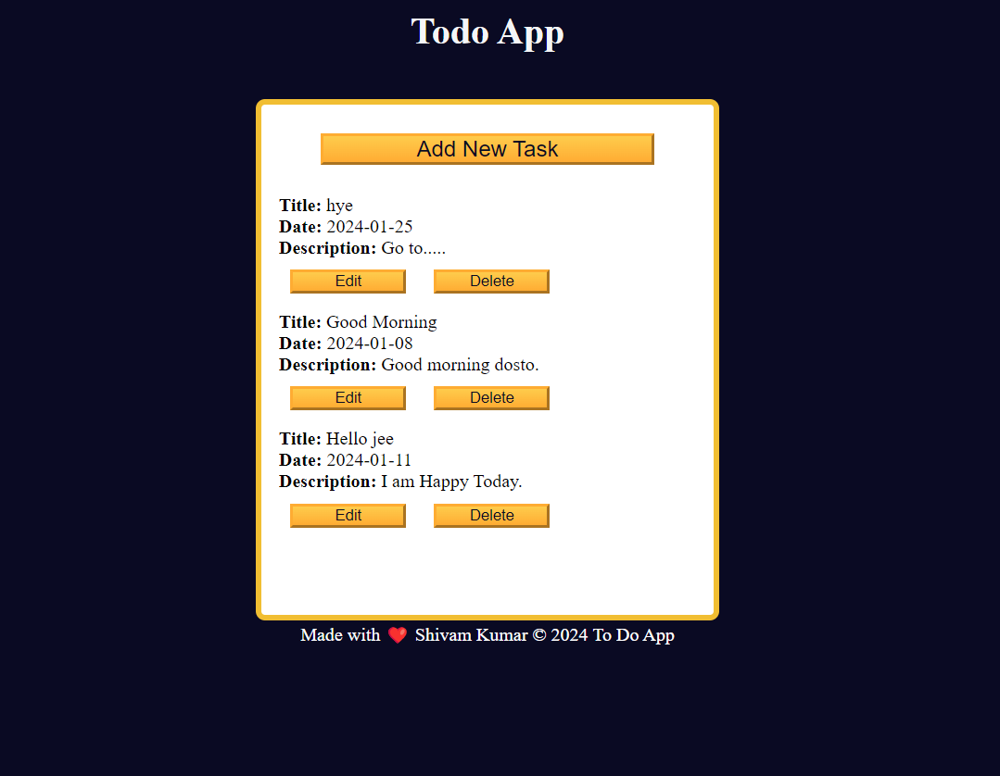

# Todo-App [website Link](https://kumarshivam04203.github.io/Todo-App/)

# Project Description
 * Todo App Local storage is a web browser feature that lets web applications store key-value pairs persistently within a user's browser.
 * This allows web apps to save data during one session, then retrieve it in a later page session.
 * TODO application, you'll learn how to handle form inputs, manage local storage, perform CRUD (Create, Read, Update, Delete) operations on tasks, implement event listeners, and toggle UI elements.
